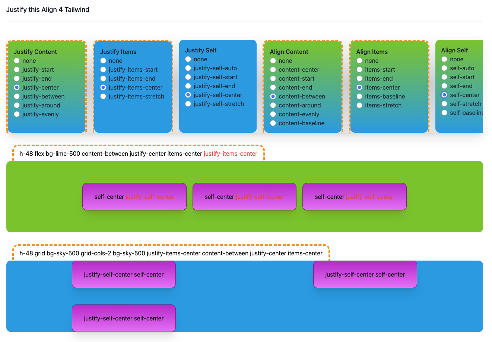

# Justify this Align 4 tailwind

Ever got confused about all the [justify](https://tailwindcss.com/docs/justify-content) / [align](https://tailwindcss.com/docs/align-content) / [self](https://tailwindcss.com/docs/align-self) / [items](https://tailwindcss.com/docs/justify-items) / [content](https://tailwindcss.com/docs/align-content) / ... classes in Tailwind? And all their possible combinations? And when you can use which one? And what will happen when you mix them together?

Fear not! *Justify this Align 4 tailwind* is here for the rescue!

This simple application:

- Allows you to manually toggle all the possible classes
- Automatically previews what will application of said classes mean for `grid` and for `flex`
- Highlights if you try to use incompatible classes for `grid` or `flex

## Live Demo

[https://justify-this-align-4-tailwind.netlify.app/](https://justify-this-align-4-tailwind.netlify.app/)

## Screenshots

